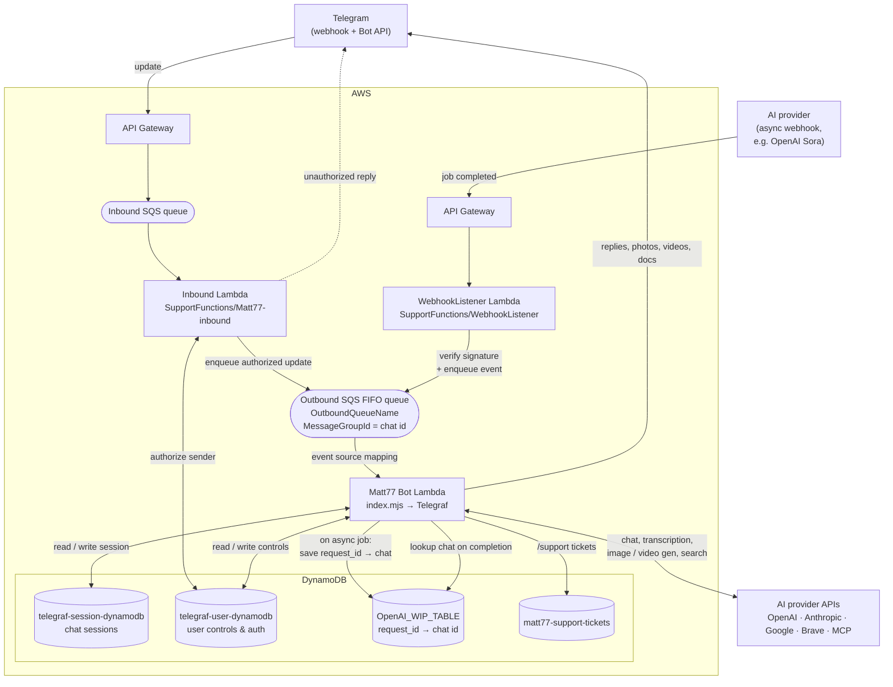

# Matt77

Matt77 is a multi-provider AI assistant that runs as a Telegram bot. It supports text chat, voice-note transcription, image generation and editing, and video generation across **OpenAI**, **Anthropic**, and **Google** models — all switchable at runtime per user. It ships with function-calling tools (Google Calendar, Brave web search, file output) and can be extended with any [Model Context Protocol (MCP)](https://modelcontextprotocol.io) server.

The bot can run as a long-polling process locally or be deployed to AWS Lambda behind an SQS queue for a fully serverless setup, using DynamoDB for per-user session storage.

> This project was built and used privately for ~3 years before being open-sourced. Expect a few rough edges around the deployment glue.

## Features

- **Multi-provider chat** — switch between GPT, Claude, and Gemini models on the fly, per user.
- **Voice transcription** — send a voice note or audio file; it's transcribed (Whisper / GPT-4o Transcribe / Gemini) and optionally treated as a prompt.
- **Image generation & editing** — GPT Image, ChatGPT Image, and Google Imagen / Gemini image models.
- **Video generation** — text-to-video and image-to-video via OpenAI Sora (and Google Veo, config-gated). Long-running jobs are tracked by request ID.
- **Function calling** — write code to files, generate/edit images, generate video, manage Google Calendar events, and search the web with Brave.
- **MCP support** — connect any MCP server (stdio or streamable HTTP) and its tools become available to the model automatically.
- **Per-user usage limits** — monthly token allowances and video quotas, with `/stats` reporting.
- **Persistent sessions** — conversation history, model preferences, and usage stored in DynamoDB.

## Architecture

```
Telegram ──▶ index.mjs (Lambda handler)  ──┐
             │  or                          │
             └─ TelegramBot/index.js (polling)
                     │
                     ├─ helpers/          middleware, callbacks, sessions
                     ├─ AiApi/            completion, whisper, images, video
                     │    └─ providers/   openai · anthropic · google
                     ├─ MCP/manager.js    MCP client manager
                     ├─ GoogleApi/        calendar
                     ├─ DynamoDb/         session & support-ticket storage
                     └─ config/           config.js, models.yml, ids.yml, mcp.json

SupportFunctions/     standalone Lambdas that front the bot in serverless mode
 ├─ Matt77-inbound/   Telegram update → auth check → outbound SQS
 └─ WebhookListener/  async AI-provider callbacks (e.g. Sora video) → outbound SQS
```

| Path | Responsibility |
| --- | --- |
| [index.mjs](index.mjs) | AWS Lambda entry point — consumes Telegram updates off an SQS queue. |
| [TelegramBot/index.js](TelegramBot/index.js) | Wires up the Telegraf bot, session middleware, MCP manager, and commands. |
| [helpers/callbacks.js](helpers/callbacks.js) | All command/message handlers and the function-calling loop. |
| [helpers/functions.js](helpers/functions.js) | Implementations of the built-in tools (image, video, calendar, search, file). |
| [AiApi/completion.js](AiApi/completion.js) | System prompt, built-in tool schemas, provider dispatch for chat. |
| [AiApi/providers/](AiApi/providers/) | Provider adapters that normalize to a common message/tool format. |
| [MCP/manager.js](MCP/manager.js) | Connects to MCP servers and exposes their tools to the model. |
| [config/models.yml](config/models.yml) | Registry of available chat/audio/image/video models and their providers. |
| [SupportFunctions/Matt77-inbound/index.mjs](SupportFunctions/Matt77-inbound/index.mjs) | Inbound Lambda — authorizes the sender against `telegraf-user-dynamodb`, then forwards authorized Telegram updates (messages and callback queries) to the outbound SQS FIFO queue. |
| [SupportFunctions/WebhookListener/index.mjs](SupportFunctions/WebhookListener/index.mjs) | Async-callback Lambda — verifies an AI provider's webhook signature (e.g. OpenAI Sora video completion) and enqueues the event to the same outbound queue. |

### Vendored dependency: `telegraf-session-dynamodb`

The [telegraf-session-dynamodb/](telegraf-session-dynamodb/) directory is a **customized fork** of [nessgor/telegraf-session-dynamodb](https://github.com/nessgor/telegraf-session-dynamodb) (MIT, © Ness Li), vendored via a `file:` dependency. It is not a pristine copy — the local changes are:

- **Overridable param hooks** — `createSession`/`saveSession` were refactored to expose `getCreateSessionParams(key)` and `getSaveSessionParams(key, session)`, so subclasses can control what is persisted. This project's [helpers/Session.js](helpers/Session.js), [ModelControlsSession.js](helpers/ModelControlsSession.js), and [UserControlsSession.js](helpers/UserControlsSession.js) rely on these hooks.
- **Env-based AWS credentials** — the constructor defaults `accessKeyId`/`secretAccessKey` from `AWS_ACCESS_KEY` / `AWS_SECRET_ACCESS_KEY`.
- **ES Modules** — converted from CommonJS (`require`/`module.exports`) to `import`/`export` to match this project's `"type": "module"`.
- Updated `telegraf` peer version, added `dotenv`, and refreshed the tests for the newer Telegraf filter API.

The upstream [LICENSE](telegraf-session-dynamodb/LICENSE) (MIT) is retained.

## Deployment Architecture (Serverless)

In serverless mode the bot never faces Telegram directly. Two thin **support Lambdas** ([SupportFunctions/](SupportFunctions/)) sit in front of it and decouple request intake from processing through an SQS **FIFO** queue, so the main bot always consumes work from one place — whether it originated from a user message or an async provider callback.



**Request path (user message).** Telegram delivers each update (via API Gateway) onto an **inbound SQS queue** that triggers the **Inbound Lambda** ([SupportFunctions/Matt77-inbound](SupportFunctions/Matt77-inbound/)). The Lambda authorizes the sender against `telegraf-user-dynamodb` (keyed `chatId:userId`): unknown users get a provisional unauthenticated record plus a "not authorized" reply, and only authorized updates — regular messages and inline-button **callback queries** alike — are forwarded (the full update JSON) onto the **outbound FIFO queue**, keyed by `MessageGroupId = chat id` (so each chat is processed in order) with a UUID dedup id. The **Matt77 Bot Lambda** ([index.mjs](index.mjs)) is triggered by that queue and hands each record to Telegraf via `bot.handleUpdate`.

**Async callback path (e.g. Sora video).** When a user requests an asynchronous job such as video generation, the bot calls the provider and immediately stores a `request_id → chat id` mapping in the **WIP table** (`OpenAI_WIP_TABLE`), then replies with the request id. The job runs asynchronously; when the provider finishes it calls the configured webhook, which hits the **WebhookListener Lambda**. That Lambda verifies the provider's webhook signature (currently OpenAI, via `client.webhooks.unwrap`) and pushes the event onto the **same** outbound queue, so the bot Lambda can resume the job — looking up the originating chat from the WIP table — and deliver the result.

Because both entry points feed one queue, the bot Lambda has a single, uniform trigger and DynamoDB holds all state (sessions, user controls, in-flight jobs, support tickets) between invocations.

> Each support Lambda is an independent package with its own `package.json` and Rollup build — `npm run build` in the function directory produces a deployable zip. Set `OutboundQueueName` and `AWS_REGION` in both; the Inbound function also needs `BOT_TOKEN` (to send the unauthorized reply), and the listener needs `OPENAI_API_KEY` and `OPENAI_WEBHOOK_SECRET`.

## Requirements

- Node.js 18+ (uses native `fetch`, ESM, and top-level `await`)
- A Telegram bot token from [@BotFather](https://t.me/BotFather)
- API keys for the providers you intend to use (OpenAI / Anthropic / Google)
- An AWS account with DynamoDB (for session persistence). Local development can run DynamoDB in Docker.

## Setup

### 1. Install

```bash
git clone <your-fork-url> Matt77
cd Matt77
npm install
```

### 2. Configure environment

Copy the template and fill in your own values:

```bash
cp .env.example .env
```

See [.env.example](.env.example) for the full list. Key variables:

| Variable | Purpose |
| --- | --- |
| `TELEGRAM_BOT_TOKEN` | Bot token from @BotFather |
| `OPEN_AI_API_KEY` / `ANTHROPIC_API_KEY` / `GOOGLE_AI_API_KEY` | Provider keys (add the ones you use) |
| `DYNAMODB_REGION` / `DYNAMODB_ACCESS_KEY` / `DYNAMODB_SECRET_ACCESS_KEY` / `AWS_REGION` | DynamoDB session storage |
| `BRAVE_API_KEY` | Enables the `brave_web_search` tool |
| `GOOGLE_SERVICE_ACCOUNT_KEY_PATH` / `GOOGLE_CALENDAR_ID` | Google Calendar integration |
| `ADMIN_CHAT_ID` | Chat that receives `/support` tickets |
| `IS_SERVERLESS` / `FUNCTION_URL` | Set for AWS Lambda mode; leave empty for polling |

`.env` is gitignored — never commit real secrets.

### 3. Configure allowed users and models

Copy the example configs and edit them (`ids.yml` and any `config/*.json` are gitignored):

```bash
cp config/ids.example.yml config/ids.yml
cp config/mcp.example.json config/mcp.json   # optional — only if using MCP servers
```

- **`config/ids.yml`** — allowlist of numeric Telegram user IDs permitted to use the bot. See [config/ids.example.yml](config/ids.example.yml).

- **`config/models.yml`** — the models exposed to users, grouped into `models` (chat), `audio_models`, `image_models`, and `video_models`. Each entry maps a provider model ID to a display `name` and `provider`. Comment out entries you don't have access to.

- **`config/mcp.json`** — MCP servers to connect at startup. See [config/mcp.example.json](config/mcp.example.json) and [MCP Servers](#mcp-servers). An empty `{ "mcpServers": {} }` disables MCP.

### 4. DynamoDB tables

The bot expects these tables (names are referenced in [TelegramBot/index.js](TelegramBot/index.js) and the DynamoDb helpers):

| Table | Purpose |
| --- | --- |
| `telegraf-session-dynamodb` | Per-user model/session state |
| `telegraf-user-dynamodb` | Per-user control state |
| `matt77-support-tickets` | Support tickets (`/support`) — override with `SUPPORT_TABLE` |
| `OpenAI_WIP_TABLE` (env var) | In-flight async jobs — maps a provider `request_id` to the originating chat so async video results can be routed back (see [Deployment Architecture](#deployment-architecture-serverless)) |

For local development you can run DynamoDB Local via Docker.

## Running

### Local (long polling)

Leave `IS_SERVERLESS` empty in `.env`, then:

```bash
npm start
```

The bot connects to Telegram and starts receiving messages. `SIGINT`/`SIGTERM` cleanly shut down the MCP connections.

### Serverless (AWS Lambda)

Set `IS_SERVERLESS` and `FUNCTION_URL`, then build the bundle:

```bash
npm run build   # produces dist/*.mjs and matt77.zip
```

Upload `matt77.zip` to Lambda. The handler in [index.mjs](index.mjs) reads updates from SQS records. Config YAML/JSON files are inlined into the bundle at build time by Rollup.

This main Lambda is fronted by the two support Lambdas in [SupportFunctions/](SupportFunctions/), which are deployed independently — each has its own `package.json` and Rollup build (`npm run build` in the function directory emits a deployable zip). Wire them up as:

1. **Telegram webhook → inbound SQS → Inbound Lambda → outbound SQS** — deliver Telegram updates (via API Gateway) onto an inbound SQS queue that triggers [SupportFunctions/Matt77-inbound](SupportFunctions/Matt77-inbound/); it authorizes the sender against `telegraf-user-dynamodb` and enqueues authorized updates onto the FIFO queue named by `OutboundQueueName`.
2. **AI provider webhook → WebhookListener Lambda → outbound SQS** — register [SupportFunctions/WebhookListener](SupportFunctions/WebhookListener/)'s API Gateway URL as the async webhook endpoint for your AI provider (currently OpenAI for Sora video events); it verifies the signature and enqueues onto the same queue.
3. **Outbound SQS → Matt77 Bot Lambda** — add the FIFO queue as an event source for the main function.

See [Deployment Architecture](#deployment-architecture-serverless) for the full diagram and data flow.

## Bot Commands

| Command | Description |
| --- | --- |
| `/stats` | View your monthly token usage and video quota |
| `/getconfig` | View all current settings |
| `/support` | Log a complaint or support ticket |
| `/clearcontext` | Clear conversation history |
| `/compact` | Summarise and compress conversation history |
| `/listmodels` | List available AI models |
| `/setgptmodel` | Switch the chat model |
| `/setaudiomodel` | Switch the audio transcription model |
| `/setimgmodel` | Switch the image generation model |
| `/setvideomodel` | Switch the video generation model |
| `/getgptmodel` / `/getimgmodel` / `/getvideomodel` / `/getaudiomodel` | Show the current model for each category |
| `/voice_prompts` | Toggle treating voice notes as AI prompts |

Model switches present an inline keyboard of the models defined in `models.yml`.

## Built-in Tools

The model can call these functions during a conversation (defined in [AiApi/completion.js](AiApi/completion.js), implemented in [helpers/functions.js](helpers/functions.js)):

- `write_code_to_file` — writes generated code to a file and sends it to the user.
- `generate_image` / `edit_image` — image generation and editing.
- `generate_video` / `generate_video_from_image` / `get_video_status` — video generation and status polling.
- `create_calendar_event` / `list_calendar_events` / `update_calendar_event` / `delete_calendar_event` — Google Calendar management.
- `brave_web_search` — up-to-date web search (requires `BRAVE_API_KEY`).

## MCP Servers

Any [MCP](https://modelcontextprotocol.io) server listed in `config/mcp.json` is connected at startup, and its tools are automatically merged into the model's tool list. Both `stdio` and streamable `http` transports are supported, and `${VAR}` placeholders in env/url/defaults are resolved from `process.env`.

```json
{
  "mcpServers": {
    "example": {
      "transport": "stdio",
      "command": "npx",
      "args": ["-y", "@example/mcp-server"],
      "env": { "API_KEY": "${EXAMPLE_API_KEY}" },
      "defaults": { "workspace": "${WORKSPACE_ID}" }
    }
  }
}
```

## Adding a Model

1. Add the model to the appropriate group in [config/models.yml](config/models.yml) with a `name` and `provider` (`openai`, `anthropic`, or `google`).
2. If the provider is already supported, that's it — it appears in `/listmodels` and the switch menus.
3. To add a new provider, create an adapter under [AiApi/providers/](AiApi/providers/) exporting a `complete(...)` function and register it in [AiApi/completion.js](AiApi/completion.js).

## Testing

```bash
npm test   # ava + c8 coverage
```

## Support

If Matt77 is useful to you, you can support its development:

<a href="https://buymeacoffee.com/laredoyin"></a>

[buymeacoffee.com/laredoyin](https://buymeacoffee.com/laredoyin)

## License

Licensed under the [Apache License 2.0](LICENSE).

The bundled [telegraf-session-dynamodb/](telegraf-session-dynamodb/) directory remains under its original [MIT license](telegraf-session-dynamodb/LICENSE) (© Ness Li) — see [Vendored dependency](#vendored-dependency-telegraf-session-dynamodb).
